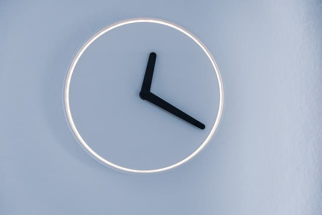

# JavaScript 時鐘



## Abstract

使用 JavaScript & CSS 動畫效果實作簡易時鐘。

## Content

### JavaScript 筆記

**步驟**

1. 選取目標元素(每個指針)
2. 實作讓指針移動的函式(function)
3. 為 function 設定定時 (1 秒執行一次)

**選取元素**

```JavaScript
const hourHand = document.querySelector('.hour-hand');
```

**setDate 函式 (指針移動)**

這邊要注意的是計算每次移動角度的邏輯，因為 CSS 修改 90 度，所以這裡要補回 90 度，且三根針的計算方式都不同。

```JavaScript
 function setDate() {
    const now = new Date();
    // 秒針
    const seconds = now.getSeconds();
    const secondsDegrees = (seconds / 60) * 360 + 90;
    secondHand.style.transform = `rotate(${secondsDegrees}deg)`;
    // 分針...
    // 時針...
}
```

**定時執行 setDate**

```JavaScript
setInterval(setDate, 1000);
```

### CSS 筆記

修改指針角度，讓三根指針都指向 12 點

```CSS
.hand{
    transform-origin: 100%;
    transform: rotate(90deg);
}

```

## Summary

**學習重點 :**

- 元素選擇
- CSS transform 效果
- SetInterval 非同步函示
