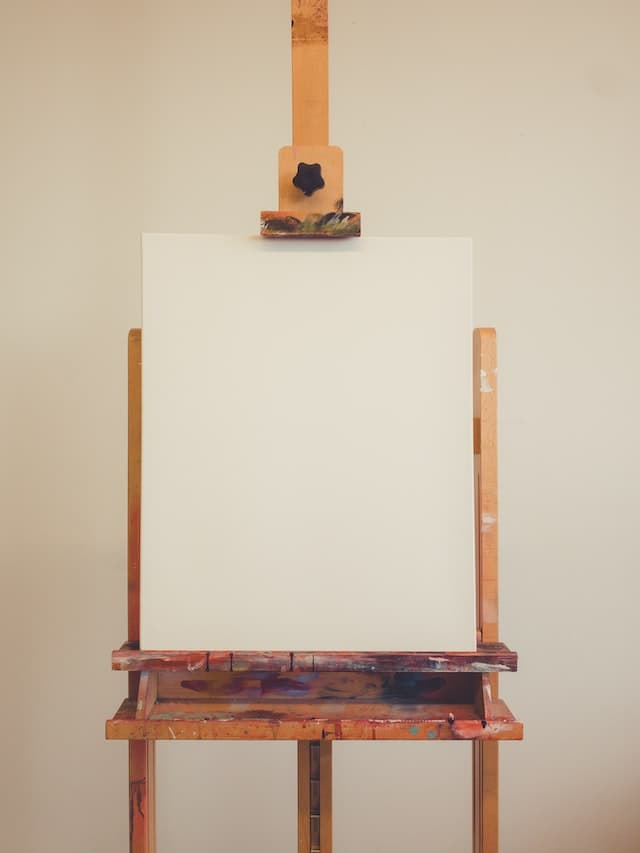

# Fun with HTML5 Canvas



## Abstract

這次的 project 介紹 HTML canvas 標籤跟 API，並搭配 JavaScript 做出畫布效果。

## Content

### 選取 HTML 元素 :

```JavaScript
const canvas = document.querySelector('#draw');
// 設定成 2d **繪圖**
const ctx = canvas.getContext('2d');
```

### 設定 Canvas 屬性 :

```JavaScript
ctx.strokeStyle = 'blue'; // 筆觸顏色
ctx.lineJoin = 'round';   // 兩線相交時的拐角
ctx.lineCap = 'round';    // 結束端點樣式
ctx.lineWidth = 50;       // 寬度
```

Canvas 內建屬性參考
[Mdn doc](https://developer.mozilla.org/zh-TW/docs/Web/API/Canvas_API/Tutorial)

### 監聽事件 :

定義布林變數來偵測滑鼠行為

```JavaScript
let isDrawing = false;
```

```JavaScript
// 按下滑鼠，isDrawing設為 true,開始繪畫功能。
canvas.addEventListener('mousedown', (e) => (isDrawing = true));

canvas.addEventListener('mousemove', draw);

// 放開滑鼠移開視窗時，isDrawing設為false,關閉功能。
canvas.addEventListener('mouseup', () => (isDrawing = false));

canvas.addEventListener('mouseout', () => (isDrawing = false));
```

### 設計 draw fn :

先判定 isDrawing 是否為 true，為 false 則返回。

```JavaScript
function draw(e) {
  // 監控滑鼠行為
  if (!isDrawing) {
    // 如果滑鼠行為不是 mousedown，返回 fn
    return;
  }
}
```

接下來定義繪畫的內容

- 用到的參數
  - ctx.beginPath()當作繪畫啟動。
  - ctx.moveTo(a,b)當作起始位置。
  - ctx.lineTo(a,b)當作終點位置。
  - ctx.stroke()代表繪製以定義的路徑。
- 先在 function 外定義最後的位置為 lastX, lastY。e.offsetX 代表回傳事件的當前座標，所以我們可以定義 e.offsetX, e.offsetY 為每次的起始位置。

  ```js
  let lastX = 0;
  let lastY = 0;

  function draw(e) {
    if (!isDrawing) return;
    ctx.beginPath();
    // 筆畫起點
    ctx.moveTo(lastX, lastY);
    // 筆畫前往
    ctx.lineTo(e.offsetX, e.offsetY); //畫到的位置。
    ctx.stroke();
  }

  canvas.addEventListener('mousedown', (e) => {
    isDrawing = true;
    // 每次 draw fn 結束後都更新筆畫起點
    [lastX, lastY] = [e.offsetX, e.offsetY];
  }); //開始繪圖
  ```

- 發現問題 : 繪製的途徑都是以同一個點當作起始位置，所以需要動態的更新起始位置

```js
// lastX = e.offsetX;
// lastY = e.offsetY;
// es6 簡寫
[lastX, lastY] = [e.offsetX, e.offsetY];
```

> 完成以上步驟，就可以在 Canvas 上面畫畫了。

## Additional

加一些程式碼，讓 canvas project 更豐富。

### 讓筆觸變色

- hsl 是一個色彩表示的方式 hsl(hue, Saturation, Lightness)。

  ```js
    let hue = 0;
    function draw(e){
    ctx.strokeStyle = `hsl(${hue}, 100%, 50%)`;//重新定義顏色
    ...
    hue++;
    while(hue>=360){
        hue = 0; //若++到360自動歸零
    }
    }
  ```

### 改變筆觸大小

改變筆觸寬度，這邊的處理方式是由細到粗，並回歸到細。

- 定義 direction 為粗細的參數，並定義其在 draw 中的變化。

- 當 direction 為 ture 時，ctx.lineWidth 遞增，當增加到 100 時把 direction 改成 false。

- 當 direction 為 false 時，ctx.lineWidth 遞減，當撿到 1 時把 direction 改成 true。

```js
function draw(e) {
  //  ...
  if (ctx.lineWidth >= 100 || ctx.lineWidth <= 1) {
    direction = !direction;
  }
  if (direction) {
    ctx.lineWidth++;
  } else {
    ctx.lineWidth--;
  }
  direction ? ctx.lineWidth++ : ctx.lineWidth--;
}
```
