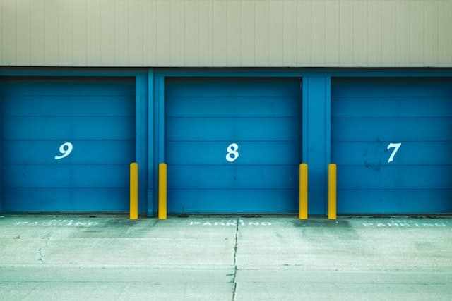

# Local-Storage



## Abstract

- 使用 localStorage 儲存功能
- 使用 event delegation ，透過 parent element 監聽行為

## 內容筆記

### CSS

#### **自訂 Checkbox 樣式**

```css
/* 取消預設checkbox  */
.plates input {
  display: none;
}

/* 利用pseudo element 添加新的 checkbox  */
.plates input + label:before {
  content: '⬜️';
  margin-right: 10px;
}

.plates input:checked + label:before {
  content: '🥄';
}
```

### JavaScript

#### **步驟**

1. 把資料存入 localStorage
2. populateList 渲染畫面
3. toggleDone 改變資料的狀態

#### **使用 localStorage 儲存資料**

可以使用 localStorage 保存資料(本地端容量約為 5MB)，要注意如果把瀏覽器快取清除，儲存資料也會一併消失，另外資料可以在 chrome dev tool 的 application 查看，所以安全性較低。

localStorage 的 API：

```javascript
localStorage.setItem('<keyName>', '<value>'); // 儲存到 localStorage
localStorage.getItem('<keyName>'); // 取得 localStorage 內容
localStorage.removeItem('<keyName>'); // 移除 localStorage 項目
```

> 參閱 [MDN - Using the Web Storage API](https://developer.mozilla.org/en-US/docs/Web/API/Web_Storage_API/Using_the_Web_Storage_API)

code block :

```javascript
addItems.addEventListener('submit', addItem);
function addItem(e) {
  e.preventDefault(); // 關閉表單預設行為
  let text = this.querySelector('input').value;
  let item = {
    text,
    done: false,
  };
  items.push(item);
  localStorage.setItem('items', JSON.stringify(items));
  this.reset(); // 使用reset() method清空表單
}
```

localStorage 資料儲存格式是 `key: value` paired，但是只能儲存字串，所以要先使用`JSON.stringify()` 把物件格式轉成 JSON 字串。

#### **渲染畫面**

把陣列轉換成 HTML DOM

code block :

```javascript
/**
 產生 HTML Element，並把寫入 platesList 元素
 **/
function populateList(plates = [], platesList) {
  platesList.innerHTML = plates
    .map((plate, i) => {
      return `
      <li>
      <input type="checkbox" data-index="${i}" id="item${i}" ${plate.done ? 'checked' : null} />
      <label for="item${i}">${plate.text}</label>
    </li>
      `;
    })
    .join('');
}
```

#### **改變資料狀態 (Event Delegation)**

希望在點選 checkbox 同時可以同步切換 localStorage 的資料狀態。

原本會採取的作法是把元素綁定事件

```javascript
const lists = document.querySelectorAll('.plates li');
lists.forEach((list) => {
  list.addEventListener('click', toggleDone);
});
```

但這麼做會有一個問題，當我們新增 `li` 時，新增的`li`不會被綁定，所以改採用 `event delegation` 的作法，我們要監聽父元素 `ul` 的 `click` 事件，因為當 `ul` 裡面的 `li` 被點擊時一樣會觸發事件，我們再透過 `e.target` 來篩選被點擊的元素。

code block :

```javascript
/**
監聽 list 的點擊事件，當被點擊時切換 checked 狀態並存到資料庫中
 **/
function toggleDone(e) {
  if (!e.target.matches('input')) return; // 跳過非 input 的元素
  const el = e.target;
  const index = el.dataset.index;
  items[index].done = !items[index].done;
  localStorage.setItem('items', JSON.stringify(items));
  populateList(items, itemsList);
}
```
