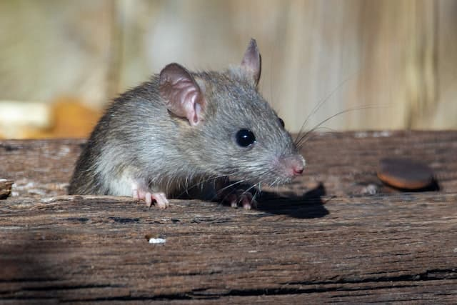

# Mouse Shadow effect



## 大綱

練習實作出文字陰影跟哲滑鼠移動的效果。

學習到的觀念有:

- 物件解構賦值
- this 指向、event target 在 event handler 的差異
- offset 屬性

## 筆記內容

### JavaScript

#### **this、e.target 差異**

在元素的事件監聽中，this 指向的元素不一定會等於 e.target 元素。

`this` 會得到監聽事件的元素。

`e.target`則會得到觸發事件的元素，有可能不是監聽元素本身。

```javascript
const hero = document.querySelector('.hero');
//欲選取元素是 hero 的 child element，所以可以用hero來選取。
const text = hero.querySelector('h1');

hero.addEventListener('mousemove', moveShadow);

function moveShadow(e) {
  console.log(this); // 回傳的一定是 ".hero"
  console.log(e.target); // 回傳的可能是 ".hero" 也可能是 "h1"
}
```

#### **物件解構賦值**

```javascript
/** 
  const width = hero.offsetWidth;
  const height = hero.offsetHeight; 
  let offsetXAdjust = event.offsetX;
  let offsetYAdjust = event.offsetY;
 **/
const { offsetWidth: width, offsetHeight: height } = hero;
let { offsetX: offsetXAdjust, offsetY: offsetYAdjust } = event;
```

> [JavaScript-Info - destructuring-assignment](https://javascript.info/destructuring-assignment)

#### **offset 屬性**

`offsetLeft`, `offsetTop`, `offsetWidth`, `offsetHeight` 是 HTML Element 屬性;

`offsetX` 和 `offsetY` 是 MouseEvent 屬性。

##### **Element 屬性**

- `offsetLeft`、`offsetTop` 回傳目前元素到 HTMLElement.offsetParent 節點( node ) 的距離，單位是 pixel。
- `offsetWidth`、`offsetHeight` 回傳元素寬高的整數值。

##### **偵測位置**

- `<h1>`的父層 `.hero`沒有設定寬度，所以`e.target.offsetLeft`會是 `<h1>`左側到`<body>`左側的距離。
- `offsetX`、`offsetY`是 MouseEvent 屬性，滑鼠進入`<h1>`元素時，指的是滑鼠到元素外層的距離。
- 所以要取得滑鼠確切的位置，用 `offsetX`( 滑鼠<->body ) + e.target.offsetLeft( h1<->body )

```javascript
if (this !== e.target) {
  // e.target === <h1> 時，滑鼠在h1上的距離加上h1外圍至body的距離
  offsetXAdjust += e.target.offsetLeft;
  offsetYAdjust += e.target.offsetTop;
}
```

##### **計算 textShadow**

以 text 為中心點，去改變 CSS textShadow 的值。

```javascript
/*
(offsetXAfterAdjust / width) 可以取得當前滑鼠x軸在 hero 元素 width 的百分比，此時原點在畫面左上角。
((offsetXAfterAdjust / width) * walk) - (walk / 2 ) 可以讓原點變成在畫面中心。
*/
const xWalk = Math.round((offsetXAdjust / width) * walk - walk / 2);
const yWalk = Math.round((offsetYAdjust / height) * walk - walk / 2);
```
