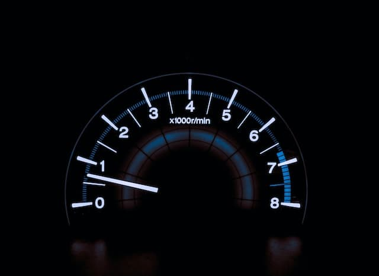

# Video Speed Controller



## Abstract

做出可以改變影片速率的控制器。類似的功能可以參考之前製作的 project 11 - Custom video player。

## Content

### 步驟拆解 (演算法)

1. 選擇相關 HTML 元素
1. 元素監聽滑鼠移動事件
1. 實作事件功能

### JavaScript 筆記

**功能實作 :**

```javascript
function handleSpeed(e) {
  /*
    e.pageY 得到瀏覽器頂端到滑鼠目前位置的 y 軸定位。
    this.offsetTop 得到遙控器 (control bar) 到瀏覽器頂端的距離。
    e.pageY - this.offsetTop 兩者相減得到觸發事件的位置；再除以遙控器的高度(this.offsetHeight)計算出事件觸發位置位於元素高度的百分比
  */
  let percent = (e.pageY - this.offsetTop) / this.offsetHeight;
  let min = 0.4;
  let max = 4;
  let height = Math.round(percent * 100) + '%';
  // 計算播放速率(0.4一跳，最多4倍速)
  let playbackRate = percent * (max - min) + min;

  // 根據行為，調整遙控器的 CSS 樣式
  speedBar.style.height = height;
  speedBar.textContent = playbackRate.toFixed(1) + 'x';
  video.playbackRate = playbackRate;
}
```

**Number.prototype.toFixed()**

使用定點小數表示法（fixed-point notation）來格式化數字。

```javascript
// 取得小數點後二位
console.log((123.456).toFixed(2)); // => 123.46
console.log((0.004).toFixed(2)); // => 0.00
```

**Math.round()**

回傳數字四捨五入後的整數值。

```javascript
console.log(Math.round(5.95), Math.round(5.5), Math.round(5.05)); // => 6 6 5

console.log(Math.round(-5.05), Math.round(-5.5), Math.round(-5.95)); // => -5 -5 -6
```

## Summary

要實作複雜的 DOM 操作，必須要花時間研究 Web API 提供了甚麼功能讓我們去取得元素的資訊。
