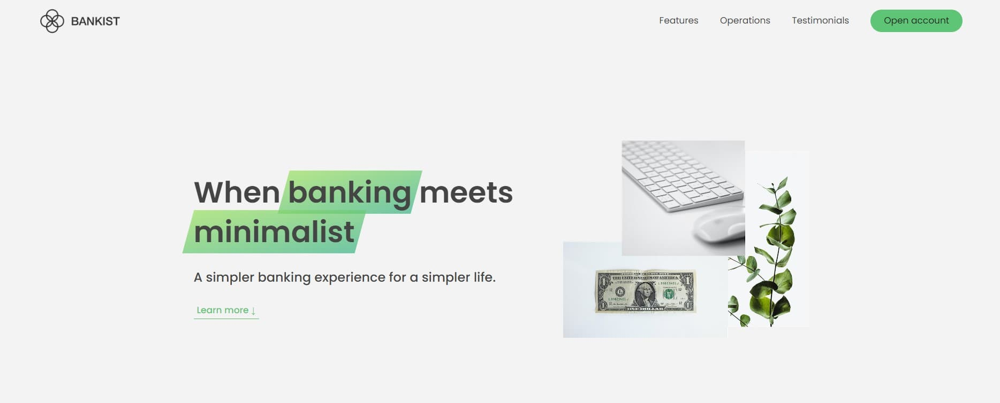

## Bankist



Implement features with DOM

## Project Specifications

- Taggable Modal
- Smooth scrolling of navigation
- Tabbed component
- Menu fade animation
- Sticky nav with Intersection observer API
- Lazy loading images
- Slider component

## Note

### Taggable Modal :

Remove/add corresponding pre-written CSS on the element while buttons are clicked

```js
const openModal = (event) => {
  event.preventDefault();
  modal.classList.remove('hidden');
  overlay.classList.remove('hidden');
};

const closeModal = () => {
  modal.classList.add('hidden');
  overlay.classList.add('hidden');
};
```

### Smooth scrolling of page navigation

Use different approaches to implement the smooth scrolling.

`window.scrollTo()` is the older way, we need to calculate the destination beforehand.

Implement event delegation in the page navigation function for better performance(Avoid binding handler for each link)

```js
// Smooth scrolling(Vintage approach)
scrollToBtn.addEventListener('click', () => {
  const s1coords = section1.getBoundingClientRect();
  window.scrollTo({
    left: s1coords.left + window.scrollX,
    top: s1coords.top + window.scrollY,
    behavior: 'smooth',
  });
});

// Page navigation(Modern approach)
document.querySelector('.nav__links').addEventListener('click', (event) => {
  // Filtering the element we want
  if (!event.target.classList.contains('nav__link')) {
    return;
  }
  event.preventDefault();
  const id = event.target.getAttribute('href');
  document.querySelector(id).scrollIntoView({ behavior: 'smooth' });
});
```

### Tabbed component :

When clicking a complex component, user may accidentally clicked irrelevant elements(in this case, a `<span>` tag), then the effect wont triggered.

To prevent such case, we need to traverse DOM tress, the `closest()` traverses the element and its parents until it finds a node that matches specified selector.

```js
tabsContainer.addEventListener('click', (event) => {
  // DOM traversal, and find the operation__tab element
  const clickedButton = event.target.closest('.operations__tab');
  const index = clickedButton.dataset.tab;
  const activeContent = document.querySelector(`.operations__content--${index}`);

  // Guard clause(if button is not clicked, terminate this function)
  if (!clickedButton) {
    return;
  }

  // Active tab
  tabs.forEach((tab) => tab.classList.remove('operations__tab--active'));
  clickedButton.classList.add('operations__tab--active');

  // Active content area
  tabsContent.forEach((content) => content.classList.remove('operations__content--active'));
  activeContent.classList.add('operations__content--active');
});
```

### Menu fade animation :

Similar to tabbed component, use `closest()` method to select the common parent, then select the siblings.

The key point here is using `Function.prototype.bind()` to pass argument into a handler function. `bind()` method creates a new function.When the new function is called, its `this` keyword set to the provide value.

```js
const handleMouseEvent = function handleMouseEvent(event) {
  // Event delegation
  if (event.target.classList.contains('nav__link')) {
    const link = event.target;

    // DOM traversal, to find the sibling elements
    const siblings = link.closest('.nav').querySelectorAll('.nav__link');
    const logo = link.closest('.nav').querySelector('img');

    siblings.forEach((el) => {
      const element = el;
      if (el === link) {
        v;
        return;
      }

      // this variable would be the argument passed in
      element.style.opacity = this;
      logo.style.opacity = this;
    });
  }
};

// Passing 'argument' into handler
nav.addEventListener('mouseover', handleMouseEvent.bind(0.5));
nav.addEventListener('mouseout', handleMouseEvent.bind(1));
```

### Sticky nav & Revealing sections with Intersection observer API :

The Intersection Observer API provides a way to asynchronously observe changes in the intersection of a target element with an ancestor element or with a top-level document's viewport. For more details and practical usage, must check mdn doc(will be attached in the summary section)

```js
const navbarHeight = nav.getBoundingClientRect().height;
const header = document.querySelector('.header');

const glueNavbar = (entries) => {
  const [entry] = entries;

  if (!entry.isIntersecting) {
    nav.classList.add('sticky');
  } else {
    nav.classList.remove('sticky');
  }
};

// Creating an intersection observer
const headerObserver = new IntersectionObserver(glueNavbar, {
  // options
  root: null,
  threshold: 0,
  rootMargin: `-${navbarHeight}px`,
});

headerObserver.observe(header);
```

A threshold of 0 means that when the target is invisible within the element specified by the root option, the callback is invoked.

```js
// Reveal sections
const allSections = document.querySelectorAll('.section');
const revealSection = (entries, observer) => {
  const [entry] = entries;

  if (!entry.isIntersecting) {
    return;
  }

  entry.target.classList.remove('section--hidden');

  // Stop observing the section
  observer.unobserve(entry.target);
};

const sectionObserver = new IntersectionObserver(revealSection, {
  root: null,

  // 10% of the target is visible within the element specified by the root
  threshold: 0.1,
});

allSections.forEach((section) => {
  sectionObserver.observe(section);
  section.classList.add('section--hidden');
});
```

### Lazy loading images :

Lazy loading is a practical technique building website with many medias, it could enhance the overall performance by loading the webpage with small size medias.

Using intersection observer API as well, dynamically replace image src when users scroll to specific position.

```js
// Select the image with data-src tag
const imgTarget = document.querySelectorAll('img[data-src]');

const loadImg = (entries, observer) => {
  const [entry] = entries;

  if (!entry.isIntersecting) {
    return;
  }

  // Replace src with data-src
  entry.target.src = entry.target.dataset.src;

  entry.target.addEventListener('load', () => {
    // Remove blur effect after image is actually loaded
    entry.target.classList.remove('lazy-img');
  });

  observer.unobserve(entry.target);
};

const imgObserver = new IntersectionObserver(loadImg, {
  root: null,
  threshold: 0,

  // Same as reveling sections, add rootMargin, therefore users won't notice the image is loading
  rootMargin: '200px',
});
imgTarget.forEach((img) => imgObserver.observe(img));
```

### Slider component：

Wrapped the code in a function, the variables won't collide.

```js
const slider = () => {
  // Select the DOM we need
  const slides = [...document.querySelectorAll('.slide')];
  const leftBtn = document.querySelector('.slider__btn--left');
  const rightBtn = document.querySelector('.slider__btn--right');
  const dotContainer = document.querySelector('.dots');

  // Initialize slide index
  let currentSlide = 0;
  const maxSlide = slides.length;

  // Use js to generate DOM
  const createDots = () => {
    slides.forEach((_, i) => {
      dotContainer.insertAdjacentHTML(
        'beforeend',
        `<button class="dots__dot" data-slide="${i}"></button>`,
      );
    });
  };

  const activateDot = (slide) => {
    document
      .querySelectorAll('.dots__dot')
      .forEach((dot) => dot.classList.remove('dots__dot--active'));

    document.querySelector(`.dots__dot[data-slide="${slide}"]`).classList.add('dots__dot--active');
  };

  const gotoSlide = (slide) => {
    slides.forEach((el, index) => {
      const currentEl = el;
      currentEl.style.transform = `translateX(${(index - slide) * 100}%)`;
    });
  };

  // Next slide
  const nextSlide = () => {
    if (currentSlide === maxSlide - 1) {
      currentSlide = 0;
    } else {
      currentSlide += 1;
    }

    gotoSlide(currentSlide);
    activateDot(currentSlide);
  };

  const prevSlide = () => {
    if (currentSlide === 0) {
      currentSlide = maxSlide - 1;
    } else {
      currentSlide -= 1;
    }

    gotoSlide(currentSlide);
    activateDot(currentSlide);
  };

  const initSlider = () => {
    createDots();
    activateDot(0);

    // Set initial slide
    gotoSlide(0);
  };

  initSlider();

  // Event handlers
  rightBtn.addEventListener('click', nextSlide);
  leftBtn.addEventListener('click', prevSlide);

  // Keyboard support
  document.addEventListener('keydown', (event) => {
    event.key === 'ArrowLeft' && prevSlide();
    event.key === 'ArrowRight' && nextSlide();
  });

  // After click the dot, update the current slide to corresponding index
  dotContainer.addEventListener('click', (event) => {
    if (event.target.classList.contains('dots__dot')) {
      const { slide } = event.target.dataset;
      gotoSlide(slide);
      activateDot(slide);
    }
  });
};
```

## Summary

### 🔑Key points

- DOM traversal and relevant DOM methods
- Function bind
- Intersection observer API

### 💡Reference:

> [MDN - Function.prototype.bind()](https://developer.mozilla.org/en-US/docs/Web/JavaScript/Reference/Global_Objects/Function/bind)
>
> [](https://developer.mozilla.org/en-US/docs/Glossary/Asynchronous)
>
> [MDN - Intersection Observer API](https://developer.mozilla.org/en-US/docs/Web/API/Intersection_Observer_API)
