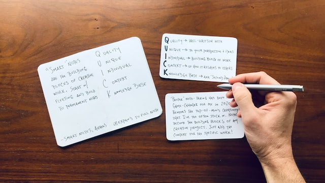

# Memory Cards



## Project Specifications

- Create flip cards using CSS
- Create "Add new card" overlay with form
- Display question cards and flip for answer
- View prev and next cards
- Add new cards to local storage
- Clear all cards from local storage

## Note

### UI

**Create flip cards using CSS :**

To implement card-flipping effects, we need a parent element that contains both side(front/back) of the card. Then we add `transform-style` property to the parent.

The property sets children of an element are positioned in the 3D space.

```css
.card__inner {
  /* Now, both front card, back card are positioned in 3D */
  transform-style: preserve-3d;
  transition: transform 0.4s ease;
}

/* card__inner children element */
.card__front,
.card__back {
  /* Properties */
}

.card.showAnswer .card__inner {
  /* Whenever the showAnswer class add to the card, the card__inner will trigger the flipping animation */
  transform: rotateX(180deg);
}
```

**Create "Add new card" overlay with form :**

We need an form element that allow users adding cards. The form must be invisible when the app were initially loaded. When users click the 'Add new card' button, the `show` class will be added to the element using JavaScript.

```css
.addon {
  /* ... other styling properties */
  transition: 0.7s all ease;
  /* Initially invisible */
  opacity: 0;
  z-index: -1;
}

.addon.show {
  /* Visible */
  opacity: 1;
  /* Let the form overlay the card element  */
  z-index: 2;
}
```

### JavaScript

**Display question cards and flip for answer:**
The `createSingleCard` function creates single card element and binds handler function for each card.

```javascript
function createSingleCard(data, index) {
  // 1)Create DOM
  const card = document.createElement('article');
  card.classList.add('card');
  if (index === 0) card.classList.add('active');

  card.innerHTML = `
    <div class="card__inner">
      <div class="card__front">
        <p class="card__content">${data.question}</p>
      </div>
      <div class="card__back">
        <p class="card__content">${data.answer}</p>
      </div>
    </div>
  `;

  // 2)Add handler for each card element when they were created
  card.addEventListener('click', () => {
    card.classList.toggle('showAnswer');
  });

  // 3)Add the card DOM data to cards array & render it
  cardsEl.push(card);
  cardsContainer.appendChild(card);
  updateCurrentText();
}
```

**View prev and next cards:**

The nextBtn & prevBtn were attached the similar handler function, thus I just mark one of them.

```javascript
nextBtn.addEventListener('click', () => {
  // Add the CSS property to trigger the transition animation (slide left)
  cardsEl[currentActiveCard].className = 'card left';

  currentActiveCard += 1;

  // When user click next button in the last card, jump to the first card
  if (currentActiveCard > cardsEl.length - 1) {
    currentActiveCard = 0;
  }

  // Add the CSS property to current card element
  cardsEl[currentActiveCard].className = 'card active';

  // Update the pagination text
  updateCurrentText();
});
```

**Add new cards to local storage**

```js
// Utility function:store card data to localStorage
const setCardsData = (cards) => {
  localStorage.setItem('cards', JSON.stringify(cards));
  window.location.reload();
};

addCardBtn.addEventListener('click', () => {
  // 1)Get the value from input & format them
  const question = questionEl.value.trim();
  const answer = answerEl.value.trim();

  // 2)Check if user filled both input
  if (!question || !answer) return;
  const newCard = { question, answer };

  // 3)Use provided data to create a new card
  createSingleCard(newCard);

  // 4)Clean input value
  questionEl.value = '';
  answerEl.value = '';
  addContainer.classList.remove('show');

  // 5)Add data to the array & store it in the localStorage
  cardsData.push(newCard);
  setCardsData(cardsData);
});
```

**Clear all cards from local storage**

```js
clearBtn.addEventListener('click', () => {
  // localStorage API to delete the data
  localStorage.clear();

  // remove all cards from DOM
  cardsContainer.innerHTML = '';

  // Explicitly reload browser
  window.location.reload();
});
```

## Summary

**Key points**

- transform-style: preserve-3d
- Clean data in localStorage
- CSS transform & transition combo

**💡Reference:**

> [MDN - transform-style](https://developer.mozilla.org/en-US/docs/Web/CSS/transform-style)
