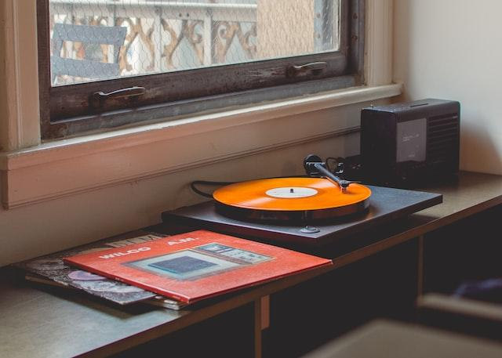

# Expense Tracker



Create beautiful UI to play music stored in the "music folder" using the HTML5 audio API

## Project Specifications

- Create UI for music player including spinning image and song detail popup
- Add play and pause functionality
- Switch songs
- Progress bar

## Note

### **UI**

Using `animation` and `keyframe` to create the Records-like spinning effect,the `animation-play-state` property specifies whether the animation is running or paused. We can use it in JavaScript to pause an animation.

```scss
.image__cover {
  // Other properties ...

  animation: rotate 3s linear infinite;
  animation-play-state: paused;
}

.music.play .image__cover {
  animation-play-state: running;
}

@keyframes rotate {
  from {
    transform: rotate((0deg));
  }
  to {
    transform: rotate(360deg);
  }
}
```

### **Script**

`songs` array stores the src name which we would us js to change dynamically. `songIndex` stores the current index of playing song.

```js
// Song titles
const songs = ['City-of-tears', 'Greenpath', 'Dirtmouth'];

// Keep track of songs
let songIndex = 0;
```

**Add play and pause functionality**

Use audio API to toggle the play/pause function.

```js
const playSong = () => {
  // Add .play class to trigger CSS animation
  musicContainer.classList.add('play');

  // Update UI
  playBtn.querySelector('i.fas').classList.remove('fa-play');
  playBtn.querySelector('i.fas').classList.add('fa-pause');

  // Audio API
  audio.play();
};

const pauseSong = () => {
  // Remove .play class to stop CSS animation
  musicContainer.classList.remove('play');

  // Update UI
  playBtn.querySelector('i.fas').classList.add('fa-play');
  playBtn.querySelector('i.fas').classList.remove('fa-pause');

  // Audio API
  audio.pause();
};
```

**Switch songs**

In the case, we return a function and a closure. The callback function will be execute whenever use click the button, and the `direction` parameter decide if the user want to switch to next song or previous song.

```js
const switchSong = (direction) => {
  // return a callback function & a closure(variable `direction` would be stored)
  return () => {
    if (direction === 'prev') {
      songIndex -= 1;
      songIndex < 0 ? (songIndex = songs.length - 1) : (songIndex = songIndex);
    } else if (direction === 'next') {
      songIndex += 1;
      songIndex > songs.length - 1 ? (songIndex = 0) : (songIndex = songIndex);
    }
    loadSong(songs[songIndex]);
    playSong();
  };
};

// Change song
prevBtn.addEventListener('click', switchSong('prev'));
nextBtn.addEventListener('click', switchSong('next'));
```

**Progress bar**

`updateProgress` :

1. Get the `duration` and `currentTime` value from event interface
2. Calculating the percentage of progress
3. Dynamically change progress bar width with percentage

`setProgress` :

1. Get the total width of progress bar
2. Get the mouse event position
3. Get the total time of current song
4. Calculate the value and assign to `currentTime`

```javascript
const updateProgress = (e) => {
  const { duration, currentTime } = e.target;
  const progressPercent = Math.floor((currentTime / duration) * 100);
  progressBar.style.width = `${progressPercent}%`;
};

const setProgress = (e) => {
  const width = e.target.clientWidth;
  const clickX = e.offsetX;
  const { duration } = audio;

  audio.currentTime = (clickX / width) * duration;
};
```

## Summary

**Key points**

- Use CSS `transition` property and `keyframe` to achieve animation.
- Audio API provide some useful methods
- Return callback function and closure for `EventListener` method of the `EventTarget` interface

**Reference:**

> [MDN - audio](https://developer.mozilla.org/en-US/docs/Web/HTML/Element/audio)
>
> [MDN - @keyframe](https://developer.mozilla.org/en-US/docs/Web/CSS/@keyframes)
>
> [Js.info - closure](https://javascript.info/closure)
