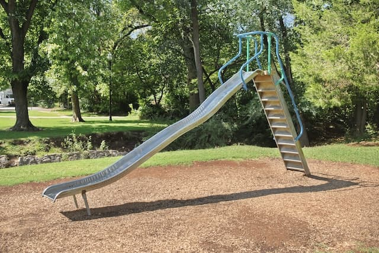

# Slide in on scroll



## 大綱

偵測 window 的 scroll event ， 並偵測目標元素目前的位置。為元素加上 CSS 樣式，做出類似滑入的動畫效果。

## 內容筆記

### CSS

- 圖片滑入

使用 opacity,transform,transition 製作圖片滑入效果。

```css
.slide-in {
  opacity: 0; /* 元素的不透明度，0是完全透明 */
  transition: all 0.5s;
}

.align-left.slide-in {
  transform: translateX(-30%) scale(0.95);
}

.align-right.slide-in {
  transform: translateX(30%) scale(0.95);
}
```

- 當卷軸卷到該張圖片，為圖片添加`.active` class，讓圖片回到原本位置，並顯示。

```css
.slide-in.active {
  opacity: 1; /* 1是不透明 */
  transform: translateX(0%) scale(1);
}
```

### JavaScript

當視窗卷軸捲到特定高度時，為該張圖片新增 `active` class

會用到的 DOM 屬性、方法:

```javascript
window.scrollY; // 得到瀏覽器視窗捲軸 Y 的高度（捲軸在最上方時是 0）
window.innerHeight; // 瀏覽器內視窗的高度
element.offsetTop; // 元素距離外層容器上方的距離
element.height; // 元素的高度
```

> 參考 [MDN-WebAPIS-WIndow](https://developer.mozilla.org/en-US/docs/Web/API/Window)

#### 找出要為圖片添加 class 的特定高度

我們希望視窗捲軸高度到該張圖片的一半高時添加 .active class

```javascript
// 取得想要添加.active的位置(瀏覽器視窗卷軸Y+瀏覽器內視窗高度-圖片高度一半)，可以自行調整
const slideInAt = window.scrollY + window.innerHeight - sliderImage.height / 2;
const imageBottom = sliderImage.offsetTop + sliderImage.height; // 取得圖片底部位置
const isHalfShown = slideInAt > sliderImage.offsetTop;
const isNotScrolledPast = window.scrollY < imageBottom;
```

要注意`offset`指的是相對於`offsetParent`的距離。一般情況`offsetParent`會是 body，如果有調整 position，`offsetParent`可能改變。

**使用`offset`屬性前，先用`offsetParent`查看該元素的父層是哪一個元素。**

#### debounce 函式

因為監聽 scroll event，瀏覽器一有 scroll 就會觸發，造成效能問題。範例中提供 debounce 函式，功能為在特定時間內，只會觸發事件一次，降低瀏覽器效能負擔。

**debounce 函式適合應用在事件頻繁觸發的情況，如 scroll、keydown**

```javascript
function debounce(func, wait = 20, immediate = true) {
  let timeout;
  return function () {
    let context = this,
      args = arguments;
    let later = function () {
      timeout = null;
      if (!immediate) func.apply(context, args);
    };
    let callNow = immediate && !timeout;
    clearTimeout(timeout);
    timeout = setTimeout(later, wait);
    if (callNow) func.apply(context, args);
  };
}
```
